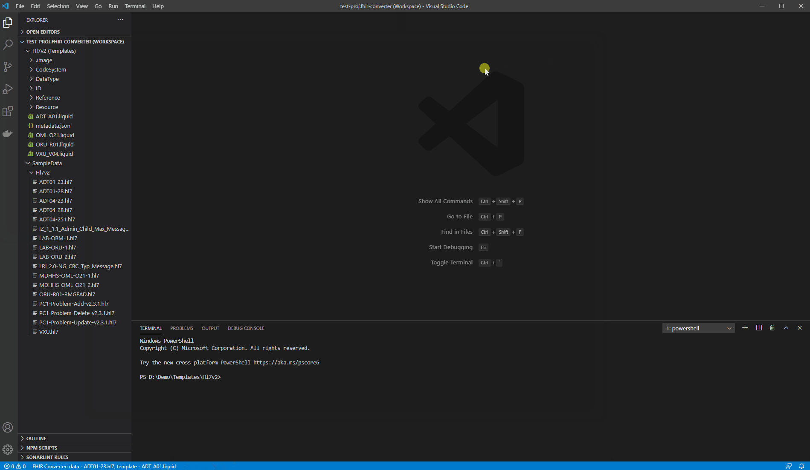

# FHIR Converter VS Code extension

FHIR Converter VS Code Extension accompanies the following Microsoft products:
1. [Azure API for FHIR](https://azure.microsoft.com/en-us/services/azure-api-for-fhir/): A managed PaaS offering in Azure that enables rapid exchange of data through Fast Healthcare Interoperability Resources (FHIR®) APIs.
2. [FHIR Server for Azure](https://github.com/microsoft/fhir-server): An open-source implementation of the [HL7 FHIR](https://www.hl7.org/fhir/) specification designed for the Microsoft cloud.
3. [FHIR Converter OSS](https://github.com/microsoft/FHIR-Converter): An open-source project that enables conversion of health data from legacy format to FHIR.

These products have the capability to convert HL7v2, C-CDA and JSON data to FHIR bundles using [Liquid](https://shopify.github.io/liquid/) templates. Microsoft publishes ready-to-use Liquid templates for HL7v2 and C-CDA to FHIR conversion, as well as sample templates for JSON to FHIR conversion. JSON messages do not have a standardized message type structure like HL7v2 or C-CDA do, so we provide you with sample JSON messages and the corresponding liquid templates for you to easily modify per your own JSON.

This extension provides an interactive editing and verification experience to create new templates and customize the default templates to meet specific needs. Currently, this extension is available on Windows and macOS system.

## Getting started

Before using the extension, you need to confirm whether the [.Net Core 3.1](https://dotnet.microsoft.com/download/dotnet/3.1) is installed in your machine. If not, you should download it first.

After you have installed the extension, follow these steps to edit the templates:
1. Login to your ACR if needed.
2. Get starting templates and put those in a folder. You can also use the sample templates published by Microsoft by following the instructions below.
3. Get sample data for testing. You can use the sample data provided by Microsoft by following the instructions.
4. Create a new converter workspace by pressing CTRL+W. You will select the root template folder and the data folder during the process.
5. Select template file and test data file using the context menu.
6. Convert data by pressing CTRL+R or by the command in the context menu. After converting, the extension should open a 3-pane view including data, template and converted FHIR bundle in the panes.
7. Edit template and/or data files and save them. Press CTRL+R to refresh the output. The output pane should get refreshed and highlight the changes in the output.
8. Save and push the changed templates to your Azure Container Registry in order to use it in $convert-data API in the FHIR Server.

See relevant service documentation for using the templates in data conversion process:

1. [$convert-data](https://docs.microsoft.com/en-us/azure/healthcare-apis/convert-data) operation in Azure API for FHIR.
1. [$convert-data](https://github.com/microsoft/fhir-server/blob/master/docs/ConvertDataOperation.md) operation in FHIR Server for Azure.
1. [FHIR Converter command line tool](https://github.com/microsoft/FHIR-Converter#command-line-tool) in FHIR Converter OSS project.

## How to guide

### 1. Login to ACR (Azure Container Registry)

You need to login to your ACR with push or pull permission if you want to push or pull templates from there. Otherwise, you can skip this step. You do not need to login to pull sample templates and sample data published by Microsoft.

Use the command `FHIR Converter: Login to Azure Container Registry (Ctrl + I)`:
- Type in the name of your ACR `<registry-name>.azurecr.io`, and press enter. It will open the terminal and run the oras tool.
- Input the username and password interactively. Your username and password are not stored. You can obtain the username and password by navigating to the Access Keys blade of your container registry in the Azure Portal.

Alternatively, you can use Docker login by following this [documentation](https://github.com/microsoft/FHIR-Converter/blob/main/docs/TemplateManagementCLI.md#authentication). 

You can logout from the ACR by running the command `FHIR Converter: Logout registry (Ctrl + O)` after you are done editing and pushing templates. You will need to enter the name of you registry.

### 2. Pull templates

You can use the command `FHIR Converter: Pull sample templates (Ctrl + T)` to pull the sample templates publicly published by Microsoft:
- Select a specific template type.
- Select a specific version.
- Select the output folder to store the templates.

If you want to pull templates from your private registry, you can use the command `FHIR Converter: Pull custom templates (Ctrl + L)` to pull templates:
- Login to ACR if needed by following Step 1.
- Enter your image reference `<registry-name>.azurecr.io/<image-name><:tag|@digest>` (image name should be lower case). 
- Select the output folder to store the templates. If the output folder is not empty, a prompt will pop up. If you choose to force overwrite, the files with the same name will be overwritten in the output folder.

### 3. Pull sample data

If you need, you can use the command `FHIR Converter: Pull sample data (Ctrl + D)` to pull the sample data published by Microsoft:
- Select a specific template type.
- Select the output folder to store the data. If the output folder is not empty, a prompt will pop up. If you choose to force overwrite, the files with the same name will be overwritten in the output folder.

### 4. Create a converter workspace

If the converter workspace has not been created, you need to create a new converter workspace by triggering the command `FHIR Converter: Create a converter workspace (Ctrl + W)`.

After the command is triggered, following actions will be needed to create a workspace:

- Select a root template folder. You can point to the folder containing sample templates if you have fetched those.

- Select a data folder.
  
- Select a workspace file name. The file name extension fhir-converter.code-workspace will be added automatically.

After that, the configuration file of the converter workspace will be saved in the workspace path, and the converter workspace will be opened in the window, which will contain the template folder and the data folder. 

The first folder in the workspace is template folder by default and you can add multiple data folders after template folder in a converter workspace.
  

### 5. Open/Switch a converter workspace

If there is already a converter workspace in the file system, you can start it in many ways such as, double-clicking on the workspace configuration file, or open the VS Code to trigger the commands `Workspaces: Open Workspace` or `File: Open Recent`.

If a converter workspace is already opened and you want to switch to another converter workspace, you can do so by triggering the commands `Workspaces: Open Workspace` or `File: Open Recent`. It will close the current workspace and open the new workspace.

### 6. Convert messages into FHIR bundles

In a converter workspace, template files and data files are shown in the explorer view. To start template editing, select a template file and a data file.

To select a file as the root template file, right click on the file having extension `.liquid` in the explorer view and select the menu item `FHIR Converter: Select as template (*.liquid)`. Similarly, to select a data file, right click on the data file having extension `.hl7`, `.ccda`, `.json` or `.xml` and select the menu item `FHIR Converter: Select as data file (*.[hl7|ccda|json|xml])`.

Both template file and data file are necessary, and you can view the selected files in the status bar before converting Data. If one of them is missing, you will be prompted to select the missing one. If both template file and data file are selected, you can convert data by selecting the context menu item `FHIR Converter: Convert data` or using the keyboard shortcut (`Ctrl + R`), and the result will be shown in results pane.

After converting data, the data segments not used in the FHIR results will be underlined in the data pane. If you don't need this feature, you can deselect the option called `Enable Unused Segments Diagnostic` in `Preferences > Settings > Workspace > Extensions > FHIR Converter` or add a setting `"microsoft.health.fhir.converter.enableUnusedSegmentsDiagnostic": false` in the workspace setting file.

### 7. Modify the selected data and templates

After modifying the template files or the data files, you can convert data by selecting the context menu item `FHIR Converter: Convert data` or pressing the keyboard shortcut (`Ctrl + R`). A differential view for the conversion result will be shown in the result tab highlighting the differences from the last run. You can jump to the previous or the next changes using the icons in the upper right corner. Differential view is turned on by default, and if you don't need this feature, you can deselect the option called `Enable Diff View` in `Preferences > Settings > Workspace > Extensions > FHIR Converter` or add a setting `"microsoft.health.fhir.converter.enableDiffView": false` in the workspace setting file.

After modifying the templates or data, remember to save the template files or data because the templates and data on the file system are used during the conversion process. If there are some unsaved templates or data, the user will be prompted to save these unsaved templates or data.

If you want to jump into the snippet templates to make some modification, you can select the context menu item `Go to Definition (F12)`  or press the keyboard shortcut `Ctrl + Click (Windows) / ⌘ + Click (macOS)` when hovering over the snippet templates. If you just hover over the snippet templates and press `Ctrl / ⌘`, a quick content preview of snippet templates will be shown for you.

Currently, the following features for snippet templates editing are supported:

- Jumping into the snippet templates
- Quick content preview of snippet templates
- Checking if snippet templates exist
- Auto completion of snippet templates

### 8. Push templates

After modifying the templates, you can save and push the custom templates to your private ACR. You must be logged in to your ACR in order to push the templates.

You can use the command `FHIR Converter: Push custom templates (Ctrl + H)` to push templates:
- Enter the image reference `<registry-name>.azurecr.io/<image-name>:<tag>`(image name should be lowcase). 
- If template folder exists in workspace, the location of template folder will be opened by default. In any case, you need to make sure to select a folder to be pushed to ACR.

### 9. Update the template folder

If you need to switch to another template folder, you can use the command `FHIR Converter: Update template folder (Ctrl + U)` to update the template folder. In addition, you can also set it through the setting panel of VS Code.

## Other useful extensions

Here are some extensions available from the Microsoft Azure Martketplace that may improve your template editing experience.

- [HL7Tools](https://marketplace.visualstudio.com/items?itemName=RobHolme.hl7tools) provides some basic language support for .hl7 files
- [Liquid Languages Support](https://marketplace.visualstudio.com/items?itemName=neilding.language-liquid) provides some basic language support for .liquid files
- [FHIR tools](https://marketplace.visualstudio.com/items?itemName=Yannick-Lagger.vscode-fhir-tools) provides FHIR validation capabilities

Microsoft provides you links to these extensions only as a convenience, and the inclusion of links to these extensions do not imply endorsement by Microsoft.  Microsoft makes no warranties, express or implied, guarantees or conditions with respect to your use of these extensions.  Microsoft disclaims all liability for any damages or losses, including direct, consequential, special, indirect, incidental or punitive, resulting from your use of these extensions.  

## Contributing

### Legal

Before we can accept your pull request, you will need to sign a **Contribution License Agreement**. All you need to do is to submit a pull request, then the PR will get appropriately labelled (e.g. `cla-required`, `cla-norequired`, `cla-signed`, `cla-already-signed`). If you already signed the agreement, we will continue with reviewing the PR, otherwise system will tell you how you can sign the CLA. Once you sign the CLA, all future PR's will be labeled as `cla-signed`.

### Code of Conduct

This project has adopted the [Microsoft Open Source Code of Conduct](https://opensource.microsoft.com/codeofconduct/). For more information see the [Code of Conduct FAQ](https://opensource.microsoft.com/codeofconduct/faq/) or contact [opencode@microsoft.com](mailto:opencode@microsoft.com) with any additional questions or comments.

## Telemetry

VS Code collects usage data and sends it to Microsoft to help improve our products and services. Read our [privacy statement](https://go.microsoft.com/fwlink/?LinkID=528096&clcid=0x409) to learn more. If you don't wish to send usage data to Microsoft, you can set the `telemetry.enableTelemetry` setting to `false`. Learn more in our [FAQ](https://code.visualstudio.com/docs/supporting/faq#_how-to-disable-telemetry-reporting).

## License

[MIT](LICENSE)
