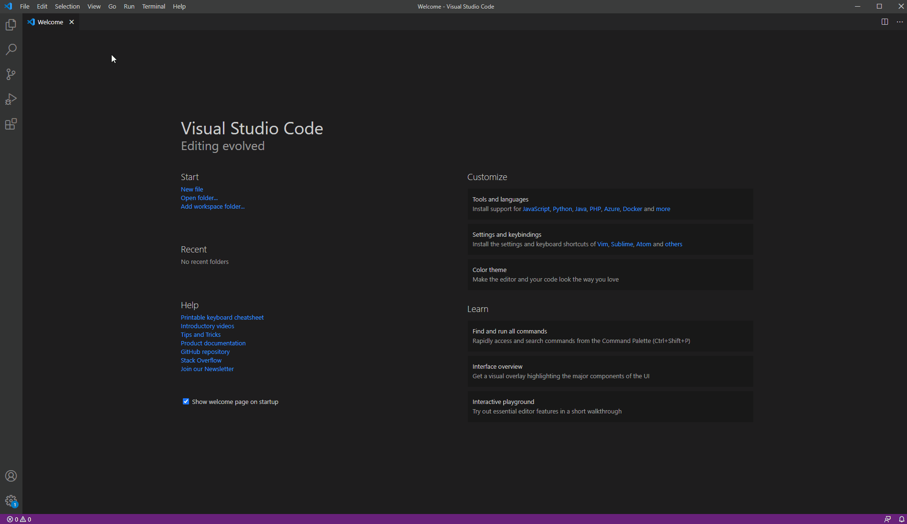
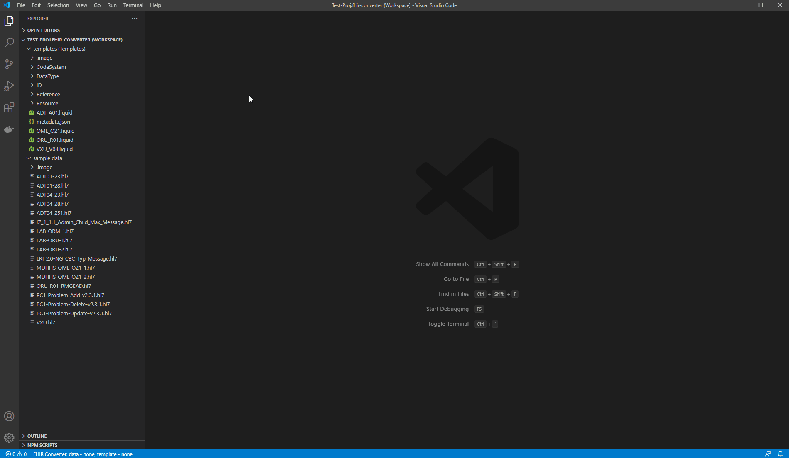
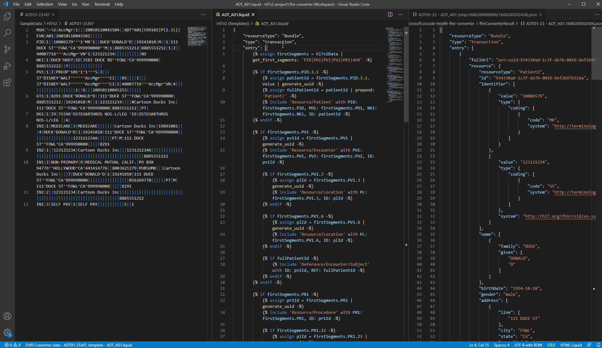
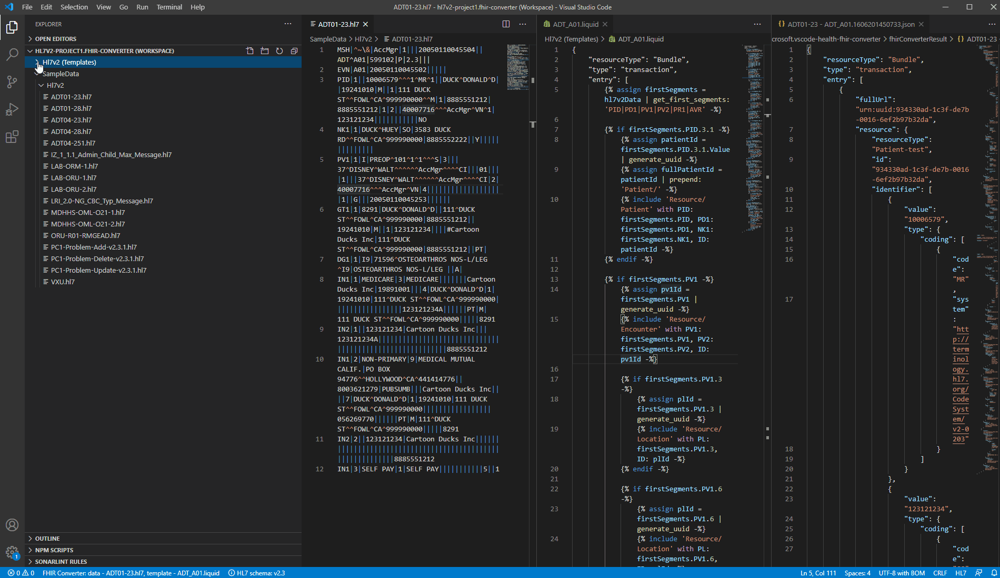

> If there are multiple extensions later in the repo, this file can be used to introduce the entire project, and the file `./FHIR-Converter/README.md` is used to introduce the FHIR Converter VS Code Extension.

# FHIR Converter VS Code Extension (Preview)

FHIR Converter VS Code Extension is developed to support the conversion of health data from legacy format to FHIR using templates that define the mappings between the two data formats.

Currently the extension supports converting HL7v2 messages into FHIR bundles using [liquid](https://shopify.github.io/liquid/) templates. Leveraging the FHIR Converter VS Code Extension, users can customize or create their own mapping templates based on their HL7v2 implementation and convert them into FHIR bundles.

Currently, the extension supports:

- Converting HL7v2 messages into FHIR bundles.
- Editing templates and messages (locally only)
- Showing differential view between results in different version
- Jumping into snippet templates
- Auto completion of snippet templates
- Checking if snippet templates exist

## Installation

### 1. Install from marketplace (To do)

Currently, the extension is only available for trial and has not been officially published to the extension marketplace, so it can't be installed directly from the marketplace. After release, installation and version upgrade from marketplace will be supported.

### 2. Install locally

Before release, you can install the extension locally with the vsix package. The specific installation steps are as follows:

- Download the vsix package for the extension. Currently, the vsix package for the FHIR Converter VS Code Extension can be downloaded from the "Releases" section in GitHub.

- Open the VS Code and go to the Extensions view (`Ctrl+Shift+X`).

- Click on the ellipsis in the upper right corner and then select the menu item `Install from VSIX` to install the vsix package.
  
After installation, you will be prompted that the extension has been installed successfully. In addition, you can use the `@installed` command to check the status of installation. If the extension exists, it indicates that the installation was successfully completed.

## Features

### 1. Create a converter workspace

At the beginning, if the converter workspace has not been created under the window, you need to create a new converter workspace by triggering the command `FHIR Converter: Create a converter workspace (Ctrl + W)` .

After triggering the command, some actions need to be completed for creating a converter workspace as follows.

- First, select a root template folder.

- Second, select a root data folder.
  
- Third, select a workspace folder to store the workspace configuration file, and then input the file name for the workspace (*.fhir-converter.code-workspace).

After that, the configuration file of the converter workspace will be saved in the workspace path, and the converter workspace will be opened in the window, which will contain the template folder and the data folder. (Tips: multiple root data folders in a workspace are supported now.)
  

### 2. Open/Switch a converter workspace

However, if there is already a converter workspace in the file system, we can start it in many ways like double-clicking on the workspace configuration file or opening the VS Code to trigger the commands `Workspaces: Open Workspace` and `File: Open Recent`.

If a workspace has been opened in the window and you want to switch to another converter workspace, you can also switch by triggering the commands `Workspaces: Open Workspace` and `File: Open Recent` because it will close the current workspace and then open the workspace by default.

### 3. Convert the HL7v2 messages into FHIR bundles

In a converter workpace, template files and data files will be shown in the explorer view. If you want to start a conversion, you need to select a template and a data file.

When hovering over the template file (`.liquid`) and rigt-click on the file on the explorer view, the context menu will be shown and you can select the menu item `FHIR Converter: Select as template` to select a root template.

When hovering over the data file (`.hl7`) and rigt-clicking on the file on the explorer view, the context menu will be shown and you can select the menu item `FHIR Converter: Select as data file` to select a data file.

Both templates and data are necessary in a conversion, so when one of them is missing, the user will be prompted to select the missing one. If both template and data file are selected, the convesion will be performed automatically, and open the files and the conversion result.

### 4. Modify the selected data and templates

After the conversion, you can modify the templates or the data. After modifying the templates or the data, you can refresh the conversion in many ways like selecting the context menu item `FHIR Converter: Refresh Preview` or using the keyboard shortcut (`Ctrl + R`) and a differential view for the conversion result will be shown in the result tab. If there are many differences in the result, you can jump to the previous or the next changes using the icons in the upper right corner.

After modifying the selected templates, remember to save the template files because the templates on the file system will be used by default during the conversion process. If there are some unsaved templates, the user will be prompted to save these unsaved templates.

If you want to jump into the snippet templates to make some modification, you can select the context menu item `Go to Definition (F12)`  or using the keyborad shortcut `Ctrl + Click` when hovering over the snippet templates.

Currently, the following features for snippet templates editing are supported :

- Jumping into the snippet templates
- Quick content preview of snippet templates
- Checking if snippet templates exist
- Auto completion of snippet templates

### 5. Update the template folder

When you need to update the template folder, the command `FHIR Converter: Update template folder (Ctrl + U)`  can be triggered to update the template folder. In addition, it can also be set through the setting panel of VS Code.

## Other available extensions

Currently, this extension doesn't support syntax highlighting for `.hl7` and `.liquid` files. However, you can install other extensions from the marketplace to obtain some language support, such as syntax highlighting.

- `HL7Tools` is an extension which provides some basic language support for `.hl7` files
  
- `Liquid Languages Support` is an extension which provides some basic language support for `.liquid` files.

## Contributing

This project welcomes contributions and suggestions.  Most contributions require you to agree to a Contributor License Agreement (CLA) declaring that you have the right to, and actually do, grant us the rights to use your contribution. For details, visit [the CLA site](https://cla.opensource.microsoft.com).

When you submit a pull request, a CLA bot will automatically determine whether you need to provide a CLA and decorate the PR appropriately (e.g., status check, comment). Simply follow the instructions provided by the bot. You will only need to do this once across all repos using our CLA.

This project has adopted the [Microsoft Open Source Code of Conduct](https://opensource.microsoft.com/codeofconduct/). For more information see the [Code of Conduct FAQ](https://opensource.microsoft.com/codeofconduct/faq/) or contact [opencode@microsoft.com](mailto:opencode@microsoft.com) with any additional questions or comments.

## License

[MIT](LICENSE)
